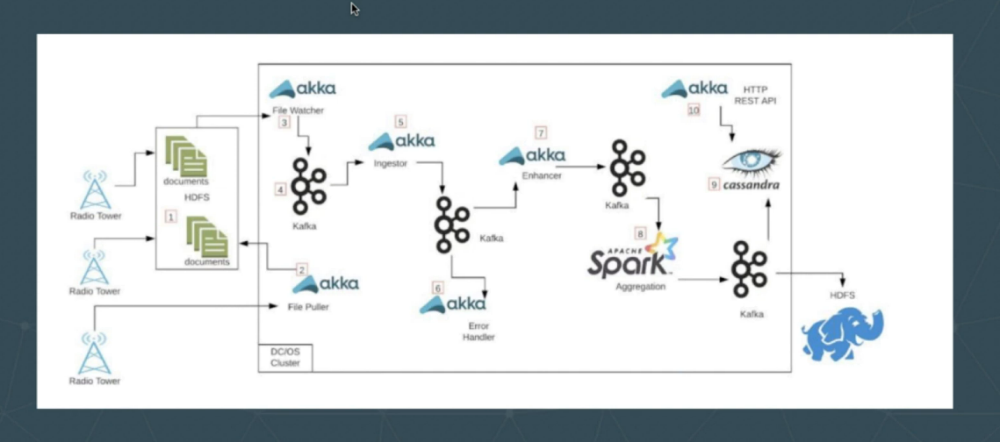
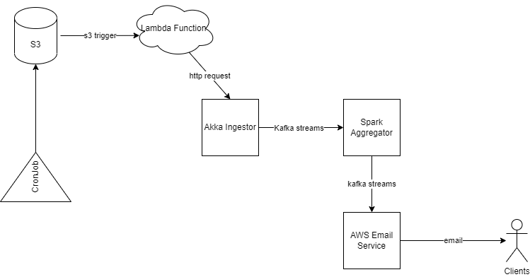
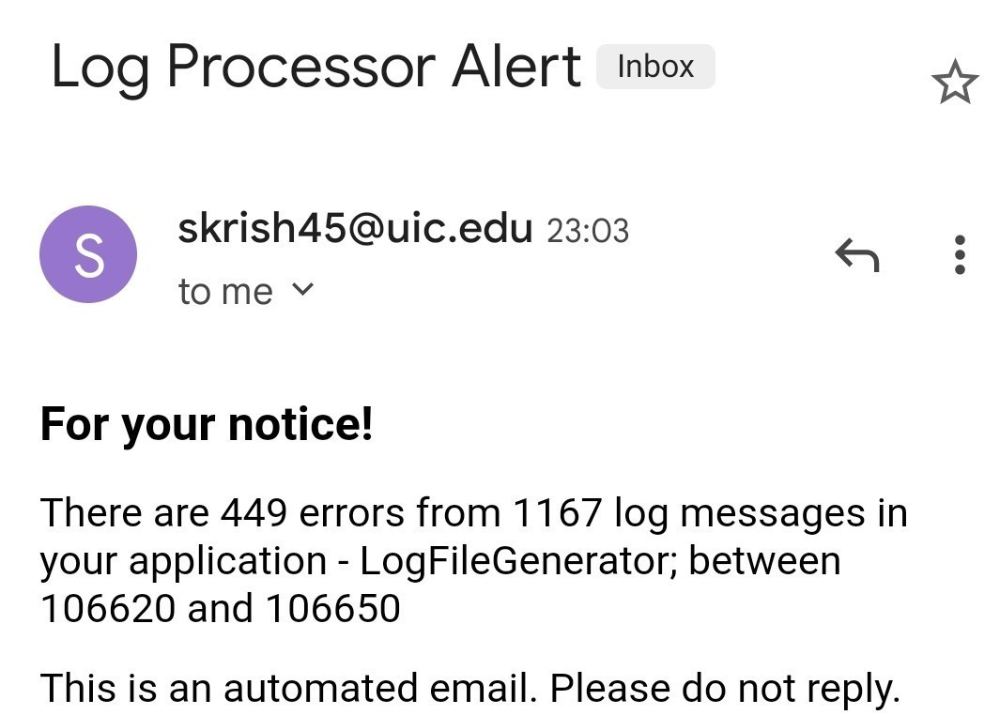

# Course Project
### The goal of this course project is to gain experience with creating a streaming data pipeline with cloud computing technologies by designing and implementing an actor-model service using [Akka](https://akka.io/) that ingests logfile generated data in real time and delivers it via an event-based service called [Kafka](https://kafka.apache.org/) to [Spark](https://spark.apache.org/) for further processing. This is a group project with each group consisting of one to six students. No student can participate in more than one group.
### Grade: 20%

## Team Members
+ Santhanagopalan Krishnamoorthy
+ Thiruvenkadam S R
+ Ashwin Bhaskar Srivatsa
+ Rahul Sai Samineni

## Development Environment
+ Language : Scala v
+ IDE : Intellij IDEA Community Edition 
+ Build Tool : SBT 1.5.2
+ Frameworks Used : CloudFlow,Akka,Spark, Kafka
+ Deployment : AWS EKS, AWS Lambda

## Installations
+ Install and build [cloudflow](https://cloudflow.io/docs/dev/administration/installing-cloudflow.html)
+ Installing [Kafka and Strimzi](https://cloudflow.io/docs/dev/administration/how-to-install-and-use-strimzi.html)
+ Adding [Spark support](https://cloudflow.io/docs/dev/administration/installing-spark-operator.html)
+ Install and setup [docker](https://docs.docker.com/get-docker/)

## Deployment
+ Create a docker repo
```
ThisBuild / cloudflowDockerRegistry := Some("docker.io")
ThisBuild / cloudflowDockerRepository := Some("<your docker hub username>")
  ```

+ Build and publish the app using 
```
sbt buildApp
```

+ To deploy the applications to kubernetes cluster 
```
$ kubectl cloudflow deploy /path/to/CS441-CourseProject/target/CS441-CourseProject.json --no-registry-credentials
```
+ After executing these commands you can see the streamlets running in different pods.

## Project Structure
+ Logprocessor - Write the logs to s3.
+ akka-log-ingestor - Contains the ingestor streamlet which receives the key from the lambda function and adds the records in kafka streams.
+ log-processor-pipeline - Contains the blueprint which defines the flow of the streamlets.
+ spark-aggregator - Contains the spark aggregation program to perform some data aggregation tasks.
+ EmailProc.scala - Contains the code to dispatch email using AWS SES.


First we need to understand certain concepts

## [Cloudflow Streamlets](https://developer.lightbend.com/docs/cloudflow/current/streamlets.html)
Streamlets are cannonical class names which have inlets and outlets. A Streamlet can have more than one inlet and outlet.
There are different streamlet shapes
+ Ingress - Ingress are streamlets with zero inlets and one or more outlets
+ Processor - A processor has one inlet and one outlet.
+ Fanout - FanOut-shaped streamlets have a single inlet and two or more outlets.
+ Fanin - FanIn-shaped streamlets have a single outlet and two or more inlets.
+ Egress - Egress has inlets but zero outlets.

## [Avro Schemas]((https://developer.lightbend.com/docs/cloudflow/current/streamlets.html))
Inlets and outlets of specific streamlets can handle data specified by Avro schemas.

## [Blueprint](https://developer.lightbend.com/docs/cloudflow/current/streamlets.html)
The shape of Streamlets with inlets and outlets are specified in a blueprint.

The image below shows a general understanding of cloudflow model.



The figure shows the structures of akka streamlets and kafka streams in a cloudflow project.
##Implementation
The overall architecture of our model is given by the image below

 

We have written a cronjob to add files to s3 bucket every 2 minutes. This triggers an AWS Lambda function which sends the key of the updated file to an akka streamlet which performs some file processing on "WARN" and "ERROR" messages.<br>
This contents are transferred to kafka streams which are accessed by the spark streamlet which performs some aggregations on these messages and sends the outputs to clients using AWS email service.

## Running the application
+ execute ``` sbt buildApp```
+ Deploy the application in amazon EKS as given in the description above
+ Run the cron job to add files to s3. After files have been added to s3 you should see the following output <br/>
 <br>

This is the output produced by the spark program which is a generated email that contains the count of "WARN" and "ERROR" messages.

## Tests
To run the test execute the command `sbt test` <br>
The test/Test.scala has all the tests to be performed
1. Test for name of the bucket
2. Test for name of the s3 bucket key of the file
3. Test for name of s3 region
4. Test for checking the email dispatching function
5. Test for Spark window


